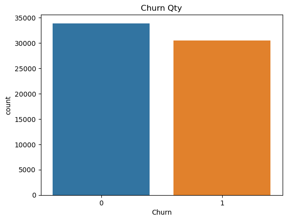
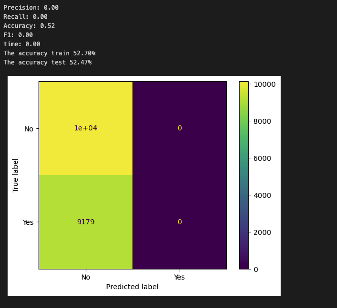
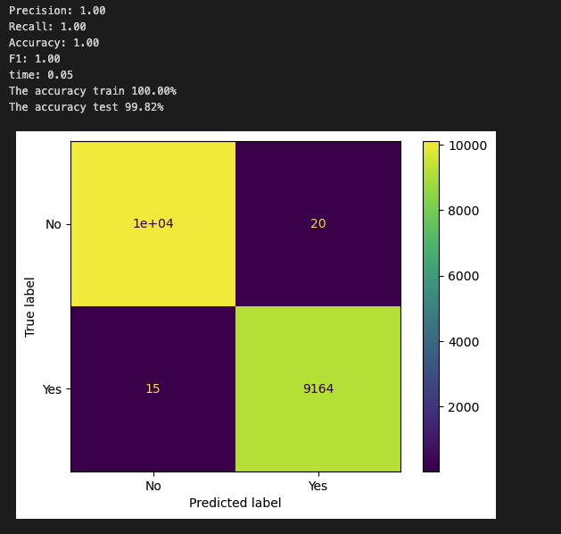
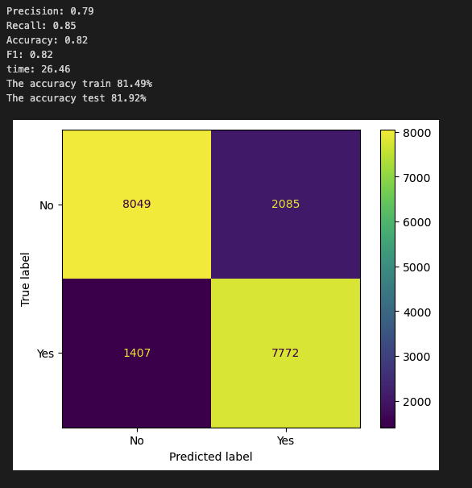
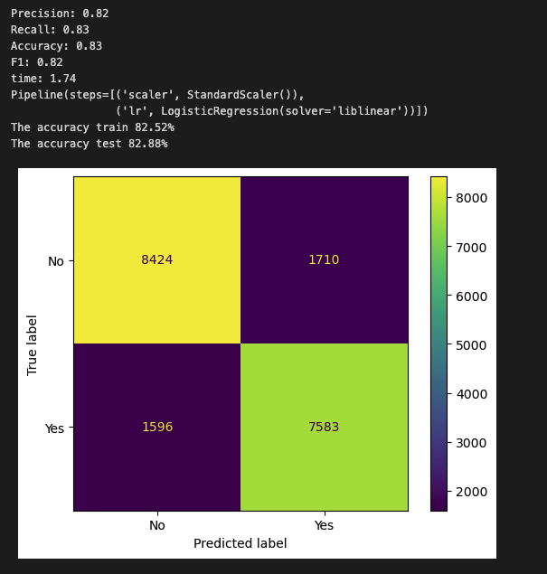
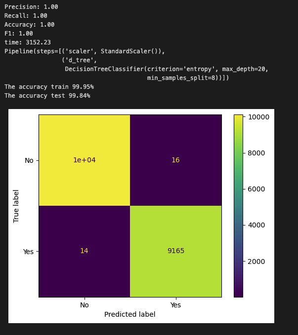
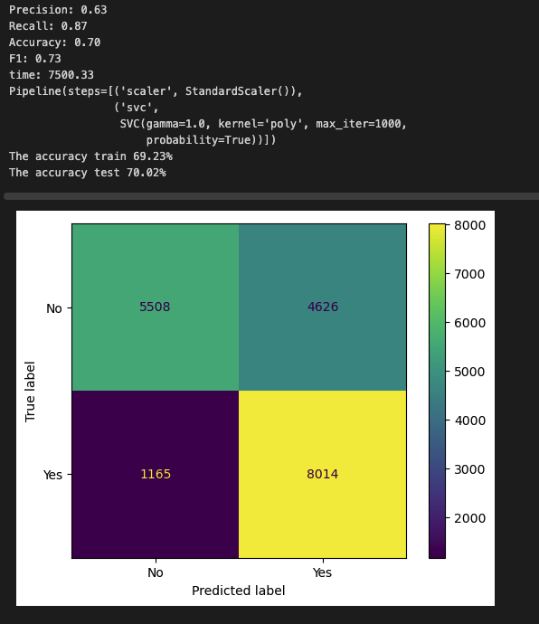

### Churn Problem Predictions
**Ronal Camilo Cuellar**

#### Executive summary
The company where I currently work is in a great growth of the commercial team and thanks to the great work that has been done in recent years and has been able to stay at the top of its segment. This growth has come with improvements in services and attention, but this does not mean that everything is always the ideal environment and there are always different aspects to improve and why customers often complain and end up leaving to the competition; in some cases these situations are not well documented or managed by the different areas causing us to have a customer turnover (churn). 

The company's management has put great emphasis on churn by trying to close all complaint gaps but not all cases are easy to identify and for some cases all measures are reactive. 

#### Rationale
The reason for the importance of this situation is to create proactive or early strategies to stop accounts that have intentions or behaviors that end in a churn, as we are currently making reactive efforts to not let go of accounts that have already let us know that they want to leave due to different needs that we do not cover and in some cases the time is not enough and they end up leaving and going to the competition.

#### Research Question
The objective of this project is to help the company find tools for the definition of action plans that help determine which customers intend to withdraw to the competition, with a clear and categorized identification of their characteristics and anticipate what is going to happen.

It is important to know when a customer tends to abandon us as a company and we have considered that some of their variables could help us to identify and initiate loyalty (retention) efforts early.

#### Data Sources
A dataset obtained for this model is used knowing that the characteristics to be used are the most similar to the commercial situation of the company.
[customer_churn_dataset.csv](https://github.com/ronalcamilo/capstone/blob/main/data/customer_churn_dataset.csv)

the data is organized by the following columns

* CustomerID: A unique identifier for each customer
* Age: The age of the customer
* Gender: Gender of the customer
* Tenure: Duration in months for which a customer has been using the company's products or services
* Usage Frequency: Number of times that the customer has used the company’s services in the last month
* Support Calls: Number of calls that the customer has made to the customer support in the last month
* Payment Delay: Number of days that the customer has delayed their payment in the last month
* Subscription Type: Type of subscription the customer has chosen
* Contract Length: Duration of the contract that the customer has signed with the company
* Total Spend: Total amount of money the customer has spent on the company's products or services
* Last Interaction: Number of days since the last interaction that the customer had with the company
* Churn: Binary label indicating whether a customer has churned (1) or not (0)

#### Methodology

1. Check nulls and duplicates

2. defining the categorical variables and their participation in the dat

| Feature | Graph | Data proportion |
| ------------- | ------------- | ------------- |
| Gender  |  |   |
| Subscription Type  |  |   |
| Contract Length  |  |   |

3. Correlation and distribution

The data distribution is quite balanced as we observe in the churn data.

By running the correlation values we found that there are no highly correlated characteristics that we should remove to improve our models so we will use all of them.

4. Training with simple methods to have a line of comparison

##### Dummy
We run a baseline with the dummy model in order to have some reference values with respect to the other models.

##### Logistic Regression
With Logistic Regression we can see quite fast training times and a high accurrency over 80 and it shows a good behavior of the characteristics.

##### KNN Neighbors
KNN had a very good time and over 80 as well.

##### Decision Tree
It was quite fast the accurrency too close to 100 which makes me suspect that we have overfitting

##### SVM
Training times too high and accurrency similar to LR where we see no major improvement.

4. Train KNN, Logistic regression, Decision tree and SVM models in search of the best one with GridSearch

##### Logistic Regression
It improved a little with the GridSearch and the assigned parameters but it was not a substantial improvement.

##### KNeighbors
had a significant improvement with the assigned parameters and accurrancy high

##### Decision Tree
By assigning new parameters in the GridSearch and pruning some paths we see that the overfitting may not be there but it still looks like it was overfitting.

##### SVM

this iteration was limited to 1000 iterations because when I ran without limits it generated a time of almost 9 hours and the results were not of great difference.

| Limited | Unlimited |
| ------------- | ------------- |
|  |   |

#### Results

The following notebook contains all the data analysis of the selected dataset using the different methodologies proposed and the findings found.

[capstone.ipynb](https://github.com/ronalcamilo/capstone/blob/main/capstone.ipynb)

In the following table we can see the results of the executions in a simple way and with grid search and from which we will start our analysis.

A review of the results shows that the execution of the models in a simple way gives very good results close to 89% in the different scores. Then, performing the execution using GridSearchCV, we found, according to the selected parameters, an improvement in some models of more than 90% in the scores.

The decision tree model achieved the highest and most satisfactory scores for this type of information, but having such a tight data I think it would not be the best as it is quite prone to overfitting I have some doubts after running the model with test data in real environment generate an imbalance and the possibility of a bad rating.

The KNN model when run with the GridSearch achieved a considerable improvement in all the scores, especially in recall, which is something I focus on, since my intention with the model is to try to identify the majority of accounts that intend to withdraw and take early actions to change their opinions.

The SVM model has taken a long time to run in its simple way and performing it with GridSearch selecting some parameters of execution took a very high training time of 9 hours so I decided to restrict in 10000 iterations since I did not find metrics higher than 90% so I discard it for the great computational effort it takes.

|  |  |   | 
| ------------- | ------------- | ------------- |
|  |   |   |
|  |   |   |

##### Feature importance

Using KNN as a base model I have decided to understand what the most important features are and to determine why they are important.

   

* I can see how late payments are a great sign that the account is not satisfied with the service and is likely to think about switching service providers.
* The support calls indicate that there are different non-conformities which may lead to customer decisions.
* The other characteristics are part of the service that can help us to get closer to the prediction but my focus would be mainly on the above described characteristics and I could refine the models further if I find other properties that are related to these nonconformity symptoms.

#### Findings

* A clear example is qualifying support calls on topics and the result of the same in order to be able to have a greater spectrum of what our clients are dissatisfied with 
* I also believe that a classification of the client as VIP or account size could help us segment and give a degree of importance to important accounts. 
* There are also several market segments where our clients are located, which can generate a rating of how much they rotate in search of a better service, which can help us determine and get closer to reality.

#### Next steps

With the approach and understanding obtained with this model selection and with the test information with which it was trained, I can begin a search for other characteristics that help me determine and refine the prediction.

* One of the next steps is to approach the quality control and customer service area and start collecting data on the characteristics that I already have and start testing with the information that I can collect, also analyzing with them and creating some interviews and looking for new ones. characteristics that help us with this identification

#### Contact and Further Information
Ronal Camilo Cuellar
Fullstack Developer
Email: ronalcamilo@gmail.com